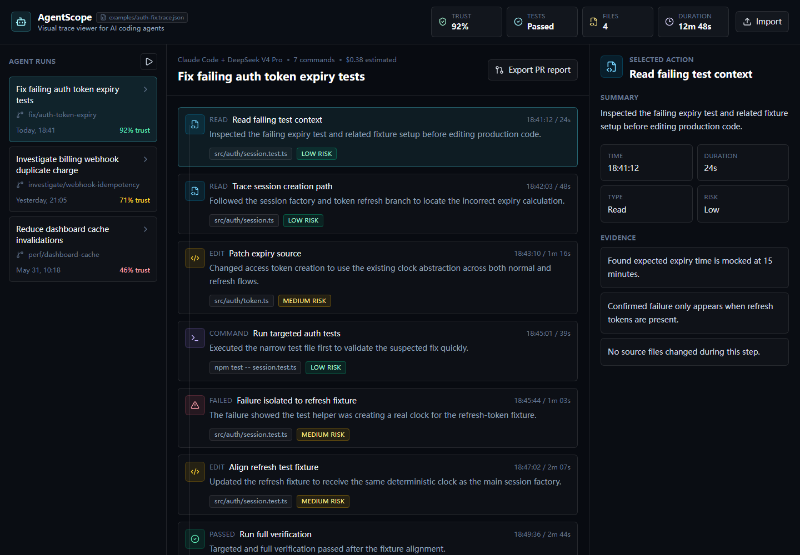

# AgentScope

Visual trace viewer for AI coding agents.

[Live demo](https://ding-swj.github.io/AgentScope/)

AgentScope helps developers inspect what an AI coding agent read, changed, ran, failed, fixed, and summarized during a coding task.

AI coding agents are powerful, but their behavior is still hard to audit. AgentScope turns each agent run into an interactive timeline so you can understand how a result was produced before you trust it.

## Screenshot



## Why AgentScope?

When an agent produces a patch, reviewers usually see the final diff, not the path that led there.

AgentScope helps answer:

- Did the agent read the right files?
- What commands did it run?
- Where did it fail?
- How did it recover?
- Were tests actually run?
- Which steps carried risk?

Think of it as developer observability for AI coding agents.

## Features

- Interactive timeline for agent actions
- Run list with trust score, status, branch, and duration
- Action detail panel with summaries, timestamps, risk levels, and evidence notes
- Output panel for command logs, test results, and code diffs
- Dark-first developer tool UI
- Realistic mock trace data out of the box

## Quick Start

```bash
npm install
npm run dev
```

Open `http://localhost:5173`.

## Example Trace

The default trace walks through a failing auth test fix:

| Step | Action | File / Command | Risk | Duration |
| ---- | ------ | -------------- | ---- | -------- |
| 1 | Read | `src/auth/session.test.ts` | Low | 24s |
| 2 | Read | `src/auth/session.ts` | Low | 48s |
| 3 | Edit | `src/auth/token.ts` | Medium | 1m 16s |
| 4 | Command | `npm test -- session.test.ts` | Low | 39s |
| 5 | Failed | `src/auth/session.test.ts` | Medium | 1m 03s |
| 6 | Edit | `src/auth/session.test.ts` | Medium | 2m 07s |
| 7 | Passed | `npm test && npm run typecheck` | Low | 2m 44s |
| 8 | Summary | PR report generation | Low | 31s |

## Trace Format

AgentScope uses a simple JSON format for traces. See the full schema at [`docs/trace-schema.json`](docs/trace-schema.json) and an example at [`examples/auth-fix.trace.json`](examples/auth-fix.trace.json).

```json
{
  "schemaVersion": "1.0.0",
  "runs": [
    {
      "id": "run-001",
      "title": "Fix login redirect bug",
      "agent": "Claude Code",
      "branch": "fix/login-redirect",
      "status": "passed",
      "trustScore": 95,
      "startedAt": "2026-06-04T10:00:00",
      "duration": "5m 12s",
      "cost": "$0.15",
      "filesChanged": 2,
      "commands": 3,
      "actions": [
        {
          "id": "a1",
          "type": "read_file",
          "title": "Read login handler",
          "file": "src/auth/login.ts",
          "timestamp": "10:00:05",
          "duration": "15s",
          "risk": "low",
          "summary": "Inspected the login handler to locate the redirect logic.",
          "details": ["Redirect uses window.location instead of router."],
          "output": "Found: window.location.href = '/'"
        }
      ]
    }
  ]
}
```

Action types: `read_file`, `edit_file`, `run_command`, `test_failed`, `test_passed`, `generate_summary`.

## Roadmap

- [x] Import external trace JSON files
- [x] Publish the AgentScope trace schema
- [ ] CLI recorder for shell commands, git diffs, and test runs
- [ ] GitHub Action integration for PR trace reports
- [ ] Execution graph for file reads, edits, and verification steps
- [ ] VS Code extension
- [ ] Adapters for Claude Code, Codex, Aider, Cursor, and more

## Stack

| Concern | Choice |
| ------- | ------ |
| Framework | React |
| Build | Vite |
| Language | TypeScript |
| Styling | Tailwind CSS |
| Icons | lucide-react |

## Development

```bash
npm run lint
npm run build
```

## License

MIT
