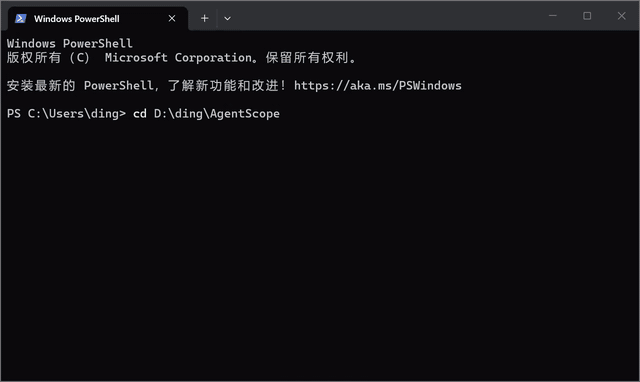

# AgentScope


[](https://github.com/ding-swj/AgentScope/actions/workflows/ci.yml)


Visual trace viewer for AI coding agents. Record, validate, and inspect agent runs locally or in CI.

[Live demo](https://ding-swj.github.io/AgentScope/) | [Release notes](docs/release-notes/v0.5.0.md) | [Trace schema](docs/trace-schema.json)

Try the live demo or record your first trace in under a minute.

AgentScope helps developers understand what an AI coding agent read, changed, ran, failed, fixed, and verified before trusting its output.

AI coding agents are powerful, but their behavior is still hard to audit. AgentScope turns each agent run into an interactive timeline so you can understand how a result was produced before you trust it.

## Demo



Inspect agent runs, replay timeline steps, drill into failures, and export a PR-ready report.

## Posts

- [我做了一个 AI Coding Agent 的可视化 Trace Viewer](https://zhuanlan.zhihu.com/p/2046588260470854469)

## Why AgentScope?

When an agent produces a patch, reviewers usually see the final diff, not the path that led there.

AgentScope helps answer:

- Did the agent read the right files?
- What commands did it run?
- Where did it fail?
- How did it recover?
- Were tests actually run?
- Which steps carried risk?

Think of it as developer observability for AI coding agents.

## Features

- Interactive timeline for agent actions
- Run list with trust score, status, branch, and duration
- Action detail panel with summaries, timestamps, risk levels, and evidence notes
- Output panel for command logs, test results, and code diffs
- Dark-first developer tool UI
- Drag-and-drop trace file import
- Realistic mock trace data out of the box

## Quick Start

```bash
npm install
npm run dev
```

Open `http://localhost:5173`.

## Example Trace

The default trace walks through a failing auth test fix:

| Step | Action | File / Command | Risk | Duration |
| ---- | ------ | -------------- | ---- | -------- |
| 1 | Read | `src/auth/session.test.ts` | Low | 24s |
| 2 | Read | `src/auth/session.ts` | Low | 48s |
| 3 | Edit | `src/auth/token.ts` | Medium | 1m 16s |
| 4 | Command | `npm test -- session.test.ts` | Low | 39s |
| 5 | Failed | `src/auth/session.test.ts` | Medium | 1m 03s |
| 6 | Edit | `src/auth/session.test.ts` | Medium | 2m 07s |
| 7 | Passed | `npm test && npm run typecheck` | Low | 2m 44s |
| 8 | Summary | PR report generation | Low | 31s |

## Trace Format

AgentScope uses a simple JSON format for traces. See the full schema at [`docs/trace-schema.json`](docs/trace-schema.json) and an example at [`examples/auth-fix.trace.json`](examples/auth-fix.trace.json).

```json
{
  "schemaVersion": "1.0.0",
  "runs": [
    {
      "id": "run-001",
      "title": "Fix login redirect bug",
      "agent": "Claude Code",
      "branch": "fix/login-redirect",
      "status": "passed",
      "trustScore": 95,
      "startedAt": "2026-06-04T10:00:00",
      "duration": "5m 12s",
      "cost": "$0.15",
      "filesChanged": 2,
      "commands": 3,
      "actions": [
        {
          "id": "a1",
          "type": "read_file",
          "title": "Read login handler",
          "file": "src/auth/login.ts",
          "timestamp": "10:00:05",
          "duration": "15s",
          "risk": "low",
          "summary": "Inspected the login handler to locate the redirect logic.",
          "details": ["Redirect uses window.location instead of router."],
          "output": "Found: window.location.href = '/'"
        }
      ]
    }
  ]
}
```

Action types: `read_file`, `edit_file`, `run_command`, `test_failed`, `test_passed`, `generate_summary`.

## CLI Recorder

AgentScope ships with a lightweight CLI recorder that wraps any command and produces a trace file.

```bash
# Record a test run
npm run agentscope -- record -- npm test

# Record any shell command
npm run agentscope -- record -- npm run build

# Validate a trace file
npm run agentscope -- validate .agentscope/example.trace.json

# Import a JSONL action log
npm run agentscope -- import-jsonl examples/generic-agent.jsonl

# Import a Claude/Codex-style session JSON export
npm run agentscope -- import-session examples/agent-session.json

# Generate a Markdown summary from a trace
npm run agentscope -- summarize --input examples/auth-fix.trace.json --dry-run
```

The recorder captures:

- Shell command executed
- Working directory and git branch
- Command exit code
- stdout and stderr output
- Wall-clock duration

The output is written to `.agentscope/YYYY-MM-DD-HHmmss.trace.json`. Open it in the Web UI via the Import button in the header, or drag and drop the file anywhere on the page.

For details, see [`docs/vision.md`](docs/vision.md#phase-2-real-data).

For framework-specific traces (file reads, code edits, test results captured at the agent tool-call level), see [`docs/adapters.md`](docs/adapters.md). The Generic JSONL adapter is available (`import-jsonl`), and the Session JSON adapter (`import-session`) can import common Claude/Codex-style tool-call exports. See [`docs/generic-jsonl.md`](docs/generic-jsonl.md) and [`docs/session-json.md`](docs/session-json.md) for step-by-step guides.

## GitHub PR Comments

AgentScope can turn a trace file into a Markdown PR summary. In local dry-run mode:

```bash
npm run agentscope -- summarize --input examples/auth-fix.trace.json --dry-run
```

In GitHub Actions, omit `--dry-run` to create or update one AgentScope comment on the PR:

```yaml
permissions:
  contents: read
  issues: write
  pull-requests: write

steps:
  - uses: actions/checkout@v4
  - run: npm ci
  - run: npm run agentscope -- import-jsonl examples/generic-agent.jsonl
  - run: npm run agentscope -- summarize --input .agentscope/*.trace.json
    env:
      GITHUB_TOKEN: ${{ secrets.GITHUB_TOKEN }}
```

Repeated workflow runs update the existing AgentScope comment instead of creating duplicates.

## GitHub Actions

AgentScope can run inside CI to record traces, validate them, and upload them as artifacts. See [`docs/github-actions.md`](docs/github-actions.md) for the setup guide and [`examples/github-actions/record-trace.yml`](examples/github-actions/record-trace.yml) for a copy-pasteable workflow.

## Current Status

AgentScope is in active development. The v0.5.0 release adds GitHub PR summary comments (`summarize`) alongside the Web UI, CLI recorder, trace validation, Generic JSONL adapter, drag-and-drop import, and GitHub Actions integration.

```bash
# Record a trace
npm run agentscope -- record -- npm test

# Validate a trace
npm run agentscope -- validate .agentscope/*.trace.json

# Generate a PR-ready Markdown summary
npm run agentscope -- summarize --input .agentscope/*.trace.json --dry-run

# Import an agent session export
npm run agentscope -- import-session examples/agent-session.json

# View in the Web UI
npm run dev
# Then import the trace via the Import button or drag-and-drop
```

See [`CHANGELOG.md`](CHANGELOG.md) for release history and [`docs/release-notes/v0.5.0.md`](docs/release-notes/v0.5.0.md) for the latest release notes.

## Feedback

Which agent adapter should AgentScope support first? Vote or leave context in [this feedback issue](https://github.com/ding-swj/AgentScope/issues/4).

## Roadmap

- [x] Import external trace JSON files
- [x] Publish the AgentScope trace schema
- [x] CLI recorder for shell commands and test runs
- [x] [Generic JSONL adapter](docs/generic-jsonl.md) for tool-call level traces
- [x] [Session JSON adapter](docs/session-json.md) for Claude/Codex-style exports
- [x] GitHub Action integration for PR trace reports
- [ ] Execution graph for file reads, edits, and verification steps
- [ ] VS Code extension
- [ ] Native adapters for Claude Code, Codex, Aider, Cursor

## Stack

| Concern | Choice |
| ------- | ------ |
| Framework | React |
| Build | Vite |
| Language | TypeScript |
| Styling | Tailwind CSS |
| Icons | lucide-react |

## Development

```bash
npm run lint
npm run build
```

## License

MIT
